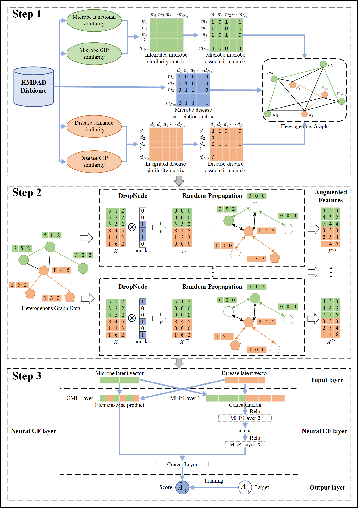

# GRNCFMDA

Predicting potential microbe-disease associations based on heterogeneous graph random neural network and neural collaborative filtering.

## Download and configure

```python
git clone https://github.com/chenyunmolu/GRNCFMDA.git
cd GRNCFMDA
pip install -r requirements.txt
```

## Environmental requirements

Install python3 for running this code（Python 3.6 myself）. And these packages should be satisfied:

- numpy~=1.19.2
- pandas~=1.1.5
- pytorch~=1.10.2
- pytorch-cuda~=11.8
- dgl~=1.0.1.cu116
- scikit-learn~=0.24.2
- scipy~=1.5.2
- xlsxwriter~=3.2.0
- matplotlib~=3.3.4

## Dataset

The dataset comes from [HMDAD](https://www.cuilab.cn/hmdad) and [Disbiome](https://disbiome.ugent.be/home).

| Dataset  | Microbe | Disease | Known associations |
| -------- | ------- | ------- | ------------------ |
| HMDAD    | 292     | 39      | 450                |
| Disbiome | 1584    | 355     | 8697               |

## Input file

**All input files are in the Dataset directory, and the relevant file information for each dataset is in the corresponding directory**.

- `mircobe_disease_association_matrix.csv`：The correlation matrix between microbes and diseases，The first column represents the various names of microorganisms, and the first row represents the various names of diseases. In addition, the intersection of the rows and columns corresponding to microorganisms and diseases is 1, indicating a known association, and 0, indicating an unknown association.
- `disease_do_similarity.csv`：The semantic similarity matrix of diseases, the DOID of diseases is obtained from [Disease Ontology](https://disease-ontology.org/) and calculated using the R package DOSE.
- `disease_name_doid.csv`：Contains the name and DOID corresponding to the disease，the DOID of diseases is obtained from [Disease Ontology](https://disease-ontology.org/) and calculated using the R package DOSE.
- `disease_GIP_similarity.csv`：Disease Gaussian Interaction Profile Kernel (GIP) similarity matrix.
- `disease_similarity_fusion_matrix.csv`：A comprehensive similarity matrix that integrates disease semantic similarity and GIP similarity.
- `microbe_functional_similarity.csv`：The functional similarity matrix of microorganisms is calculated based on the correlation matrix and disease semantic similarity matrix.
- `microbe_GIP_similarity.csv`： Microbe Gaussian Interaction Profile Kernel (GIP) similarity matrix.
- `microbe_similarity_fusion_matrix.csv`：A comprehensive similarity matrix that integrates microbial functional similarity and GIP similarity.
- `HMDAD.xlsx/Disbiome.xlsx`：The original correlation data downloaded from [HMDAD](https://www.cuilab.cn/hmdad) / [Disbiome](https://disbiome.ugent.be/home), after removing duplicate data, can obtain the correlation matrix between microorganisms and diseases.

**When you want to run your own data, you have to replace the above files.**

## Running files

- `GRNCFMDA.py`：The main file for running the GRNCFMDA model is based on the HMDAD database for prediction by default.
- `model.py`：The file contains the basic models for building GRNCFMDA models, such as GRAND and NCF models.
- `utils.py`：The file contains methods such as building heterogeneous graphs, setting random seeds, and drawing ROC curves, and belongs to the toolkit file.

## Run in HMDAD or Disbiome

To run the model, default 5 fold cross validation.

```python
arguments:
  --dataset: The types of datasets include HMDAD and Disbiome

example:
  Run GRNCFMDA in the HMDAD database:
    python GRNCFMDA.py --dataset HMDAD
  Run GRNCFMDA in the Disbiome database:
    python GRNCFMDA.py --dataset Disbiome
```


## The flowchart of GRNCFMDA

